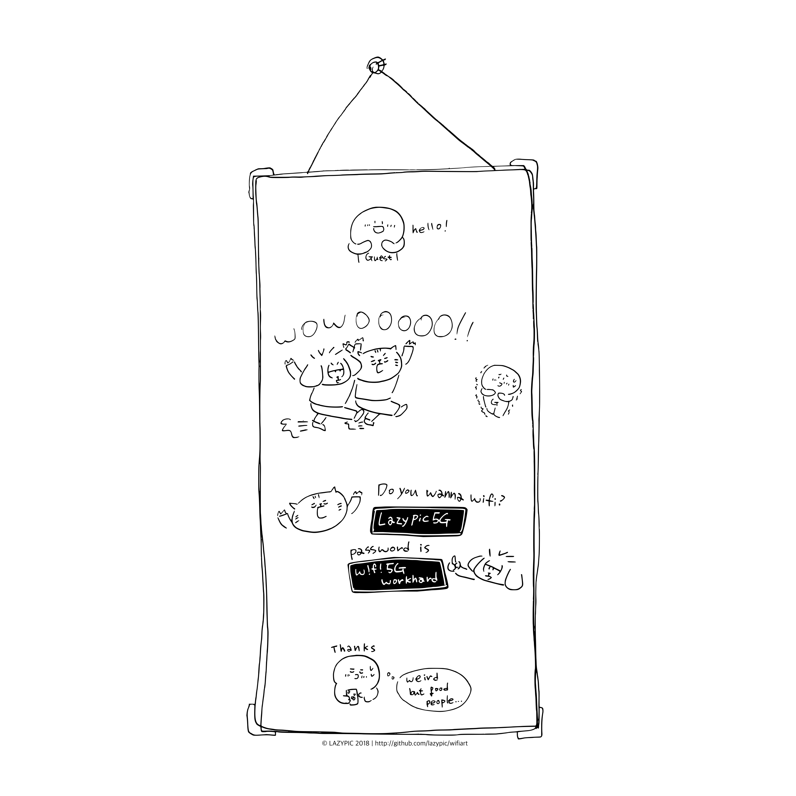

# wifiart
wifiart 프로젝트는 lazypic 방문객에게 만화를 이용해서
즐겁게 wifi 패스워드를 알려주는 문화입니다.

완성된 만화는 이 리포지터리에 `.svg`, `.png`, `.pdf` 파일로 백업되어집니다.



#### 작업에 사용된 유틸리티
- convert : 스캔이미지를 bmp로 변환하기 위해서 사용했습니다.

```bash
$ convert scanimage.png scanimage.bmp
```

- potrace : bmp 이미지를 vector로 변환하기 위해서 사용했습니다.

```bash
$ potrace --svg scanimage.bmp -o scanimage.svg -k 0.8
```

- svg를 편집하기 위해서 [iVinci Express](https://itunes.apple.com/kr/app/ivinci-express/id607900811?mt=12)

- qlmanage : svg 편집이후 인쇄를 위해 인쇄해상도에 해당하는 bitmap 변경. A4 300dpi에 해당하는 픽셀수는 2480x3508 입니다.

```bash
$ qlmanage -t -s 3508 -o . scanimage.svg
```
